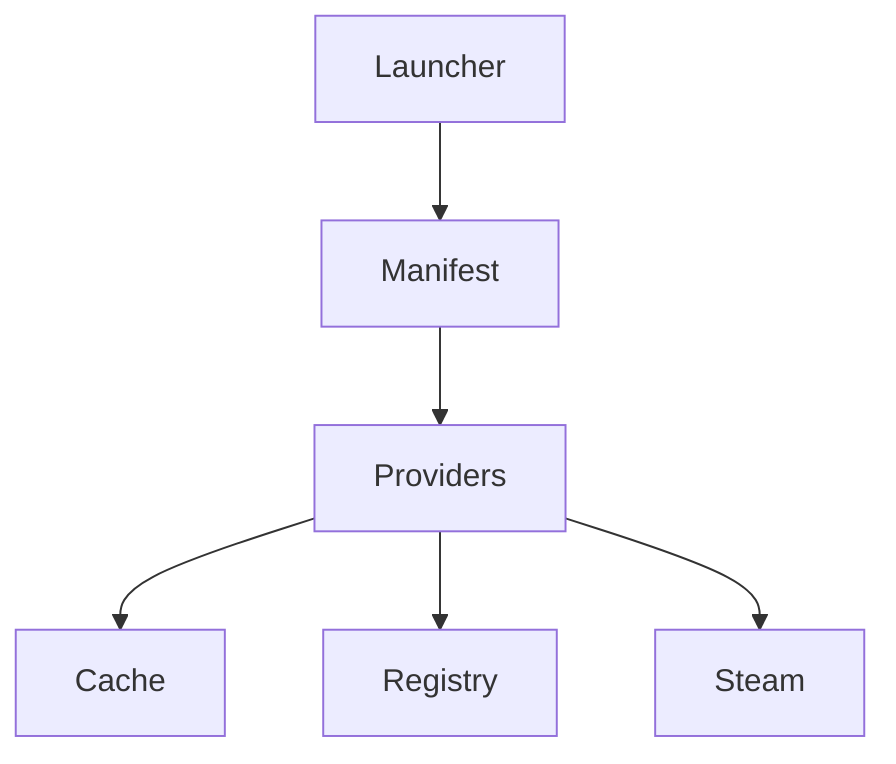
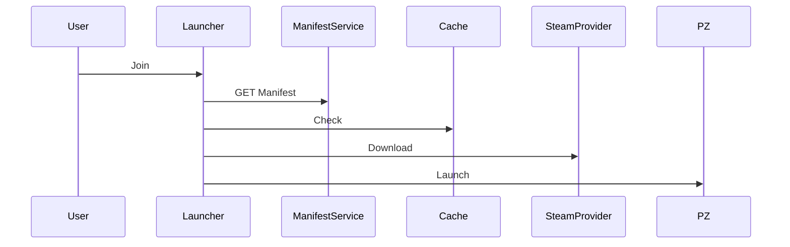

اگر قصد داری بخش زیادی از توسعه را با LLM Agentها جلو ببری، به نظرم **کیفیت مستندات از کیفیت کد مهم‌تر است**. چون Agentها روی Context و قراردادها زندگی می‌کنند.

من احتمالاً این Workflow را انتخاب می‌کردم:

---

# 1. Markdown + RFC Style

همه چیز را داخل Git نگه دار.

```text
docs/

    vision.md

    architecture.md

    glossary.md

    service-boundaries.md

    api-contracts.md

    database-schema.md

    manifest-schema.md

    provider-system.md

    profile-system.md

    launcher-core.md

    roadmap.md

    rfc/
```

این ساده‌ترین و Agent-Friendly ترین روش است.

---

# 2. ADR (Architecture Decision Records)

به جای اینکه فقط نتیجه را مستند کنی، دلیل تصمیم‌ها را هم ثبت کن.

مثلاً:

```text
docs/adr

0001-use-go.md

0002-use-postgres.md

0003-use-wails.md

0004-monorepo.md

0005-provider-system.md
```

نمونه:

```md
# ADR-0003

## Decision

Use Wails instead of Electron.

## Reasons

- Lower memory usage
- Native binaries
- Go integration
- Easier distribution

## Consequences

- Smaller ecosystem
- Less UI libraries
```

این‌ها برای LLMها فوق‌العاده ارزشمند هستند.

---

# 3. RFCها (مهم‌ترین قسمت)

تقریباً هر قابلیت جدید باید RFC داشته باشد.

مثلاً:

```text
docs/rfc

0001-manifest-format.md

0002-profile-system.md

0003-provider-system.md

0004-download-manager.md

0005-cache-system.md

0006-steam-provider.md

0007-registry-service.md
```

فرمت:

```md
# Problem

چه مشکلی وجود دارد؟

# Goals

هدف چیست؟

# Non Goals

چه چیزی جزو هدف نیست؟

# Design

طراحی.

# API

قراردادها.

# Alternatives

روش‌های دیگر.

# Open Questions

سؤالات حل نشده.
```

---

# 4. Mermaid Diagram

Agentها Mermaid را خیلی خوب می‌فهمند.

مثلاً:

````md

````

برای Sequence Diagram:

````md

````

---

# 5. OpenAPI

تمام APIها را به صورت OpenAPI بنویس.

مثلاً:

```yaml
schemas/openapi/directory.yaml
schemas/openapi/registry.yaml
schemas/openapi/auth.yaml
```

بعد:

* Swagger
* Redoc
* Agentها

همگی از آن استفاده می‌کنند.

---

# 6. JSON Schema

برای:

### Manifest

```text
schemas/manifest.schema.json
```

### Package

```text
schemas/package.schema.json
```

### Heartbeat

```text
schemas/heartbeat.schema.json
```

این خیلی مهم است چون Agentها بر اساس آن validation انجام می‌دهند.

---

# 7. C4 Model

من شخصاً C4 را دوست دارم.

### Level 1

System Context

```text
Player

Launcher

Directory Service

Agent

Steam
```

---

### Level 2

Containers

```text
Launcher UI

Launcher Core

Registry

Directory Service

Postgres

Redis

MinIO
```

---

### Level 3

Components

مثلاً داخل Launcher Core:

```text
ManifestManager

DownloadManager

ProviderResolver

ProfileManager

GameLauncher
```

---

# 8. Event Storming

حتی اگر Event Driven نباشی.

مثلاً:

```text
JoinRequested

ManifestFetched

DependenciesResolved

PackageDownloaded

ProfilePrepared

GameLaunched
```

این برای طراحی Domain فوق‌العاده است.

---

# 9. Cursor Rules / Agent Instructions

من احتمالاً این فایل‌ها را می‌ساختم:

```text
.ai/

    architecture.md

    coding-style.md

    golang-rules.md

    frontend-rules.md

    api-guidelines.md

    testing-guidelines.md
```

و حتی:

```text
.claude/

.cursor/

.github/copilot/
```

تا هر Agent رفتار ثابتی داشته باشد.

---

# 10. Diátaxis Framework

چهار نوع سند:

### Tutorials

شروع کار

```text
docs/tutorials
```

---

### How-To

مثلاً:

```text
How to add provider
How to create manifest
```

---

### Reference

APIها

Schemaها

---

### Explanation

چرا این معماری انتخاب شده است.

---

# چیزی که من برای پروژه‌ای با این مقیاس انجام می‌دادم

از LLMها می‌خواستم ابتدا این اسناد را تولید کنند:

```text
vision.md

architecture.md

service-boundaries.md

glossary.md

database-schema.md

manifest-schema.md

provider-system.md

profile-system.md

download-flow.md

launcher-core.md
```

و بعد از آن، برای هر feature یک RFC بنویسم.

---

و احتمالاً یک پوشه بسیار مهم هم اضافه می‌کردم:

```text
docs/domain/
```

که موجودیت‌های اصلی پروژه را تعریف کند:

```text
Server

Manifest

Package

Provider

Profile

Cache

Registry

Download

Session

Player
```

چون به تجربه، Agentها وقتی بهترین خروجی را می‌دهند که Domain Model پروژه کاملاً مستند شده باشد. این پوشه شاید ارزشمندترین بخش کل repository باشد.
